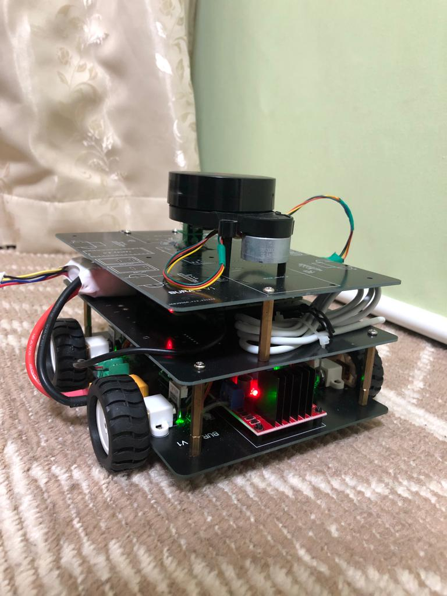
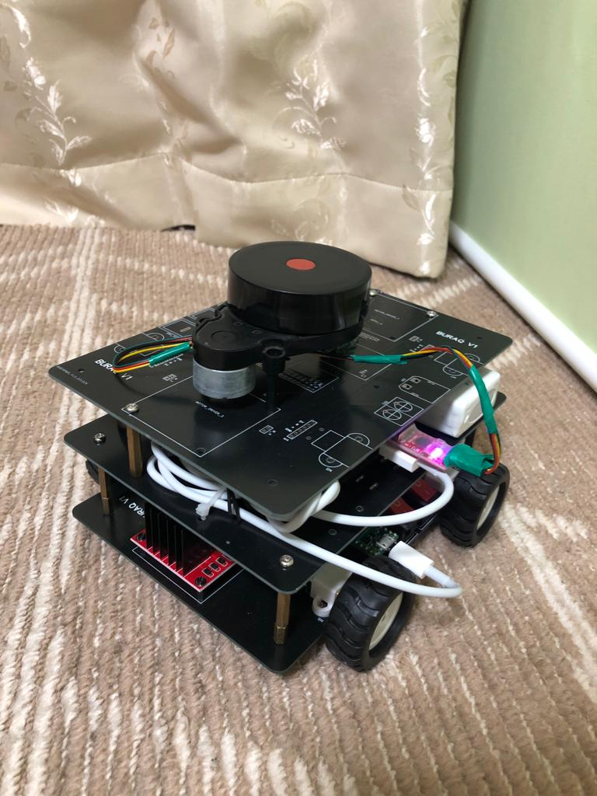
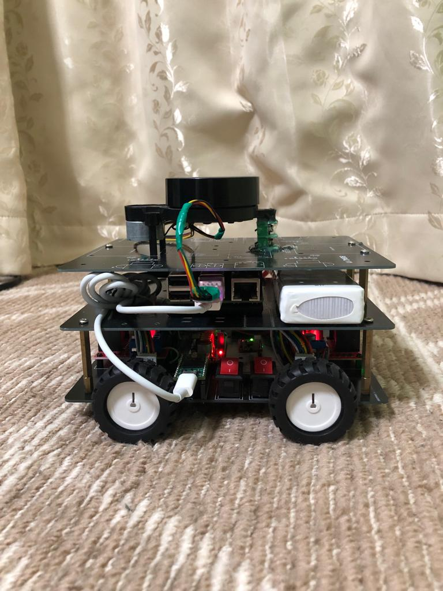

# SwiftBot: A 4-Wheel Mobile Robot Based on ROS2

Welcome to the repository for SwiftBot, a 4-wheel mobile robot that leverages the power of ROS2 and is designed for robust and versatile autonomous navigation. This project builds upon the open-source Linorobot initiative but introduces significant customizations to enhance performance and adaptability to available hardware.

## Hardware

The SwiftBot is powered by a **Raspberry Pi 4** and uses **MicroROS** running on a **Teensy 4.0** for real-time operations. The hardware setup is inspired by the Linorobot project, but modifications have been made to suit the specific components and configurations used in this build.

Detailed hardware setup instructions, component lists, and wiring diagrams are available in the `Linorobot hardware` folder. This section also includes firmware for the robot, ensuring you have all the necessary tools to get started with your build.

## Software

The `Linorobot_ws` directory houses all necessary libraries and modules for implementing SLAM (Simultaneous Localization and Mapping) and navigation functionalities. The software stack is based on **ROS2 Humble**, optimized for performance and compatibility with the hardware used in SwiftBot.

Key features include:

- **Lidar Integration**: For accurate environmental mapping and obstacle detection.
- **SLAM Capabilities**: Enabling the robot to map its environment while keeping track of its location within it.
- **Navigation Systems**: Facilitating effective path planning and maneuvering across varying terrains.

## Gallery

Explore some images of SwiftBot in action:

## Getting Started

To begin using this repository for building your own SwiftBot, follow these steps:

1. **Clone the Repository**: Obtain a copy of the code and documentation.
2. **Setup Hardware**: Assemble your robot using the guides provided in the `Linorobot hardware` folder.
3. **Install Software**: Set up the ROS2 environment and deploy the software from the `Linorobot_ws` directory.
4. **Run Tests**: Perform initial tests to ensure your robot is functioning as expected.

For more detailed instructions, refer to the setup guides available in this repository.
